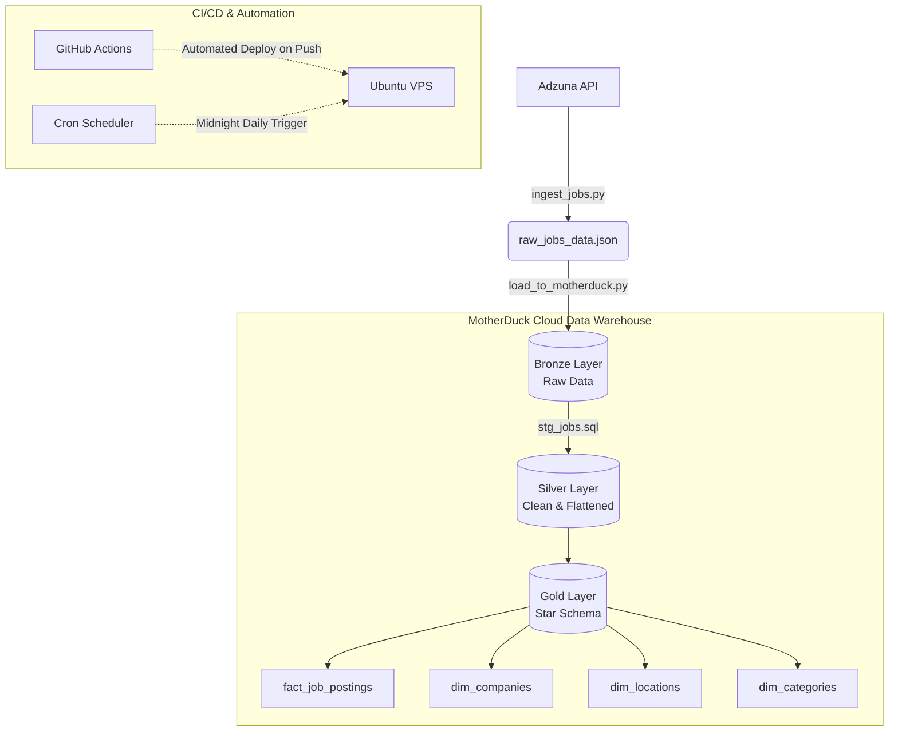

# 🚀 Automated Data Engineering Pipeline: UK Job Market Insights

Welcome to the **Tech Job Pipeline**! This project is a professional, fully automated end-to-end data pipeline designed to extract real-time job market data, clean it, and model it into an analytical **Star Schema**. 

Built with modern data engineering practices, this pipeline runs autonomously in a cloud-native environment, leveraging a **Medallion Architecture** and robust DevOps CI/CD workflows.

---

## 🏗️ Architecture Overview

The pipeline strictly follows the **Medallion Architecture** pattern (Bronze ➔ Silver ➔ Gold) to ensure data quality, reliability, and easy analytics.

### Architecture Diagram



### 1. 🥉 Bronze Layer (Raw Data)
The pipeline begins by fetching the last 24 hours of job postings across Great Britain via the Adzuna API. To respect API rate limits, the Python extraction script uses polite pagination delays. The resulting massive JSON payload is then loaded directly into a `bronze_jobs` table in MotherDuck without any modifications, preserving the raw state for historical safety.

### 2. 🥈 Silver Layer (Cleaned Data)
Raw API data is often nested and messy. Using **dbt (Data Build Tool)**, the data is transformed into a flat, tabular format (`stg_jobs`). This stage handles:
- Flattening nested JSON fields (e.g., extracting `company.display_name`).
- Enforcing strict data types (`VARCHAR`, `FLOAT`, `TIMESTAMP`).
- Deduplicating records to ensure clean, trustworthy data.

### 3. 🥇 Gold Layer (Star Schema)
To make the data lightning-fast and ready for Business Intelligence (BI) dashboards, the Silver layer is modeled into a highly efficient **Star Schema**:
- **Dimension Tables:** `dim_companies`, `dim_locations`, and `dim_categories` store unique attributes. We use the `md5()` hash function to generate deterministic, unique IDs for each record.
- **Fact Table:** `fact_job_postings` serves as the center of the schema, storing quantitative metrics (salaries, contract times) linked to the Dimension tables via hashed IDs.

---

## 🛠️ Tech Stack

This project is built using industry-standard tools:
- **Language:** Python 3.12+ (Extraction & Loading)
- **Data Warehouse:** MotherDuck / DuckDB (Cloud OLAP Storage)
- **Transformation:** dbt (Data Modeling & Testing)
- **Deployment:** Ubuntu VPS (Hosting), GitHub Actions (CI/CD)
- **Automation:** Bash Scripting, Cron Jobs (Scheduling)

---

## ⚙️ How It Works (The Automation Lifecycle)

This pipeline requires zero manual intervention. Here is how a daily cycle looks:

1. **Midnight Trigger:** The VPS server's Cron job wakes up and runs `run_pipeline.sh`.
2. **Extraction & Load:** `ingest_jobs.py` pulls the day's jobs and `load_to_motherduck.py` dumps them into the warehouse.
3. **Transformation:** The script triggers `dbt run`, which automatically rebuilds the Silver and Gold layers with the fresh data.
4. **CI/CD:** If a developer pushes new code (like a new dbt model) to the `main` branch, **GitHub Actions** automatically logs into the VPS via SSH, pulls the latest code, installs any new dependencies, and ensures the pipeline is always running the latest version.

---

## 🚀 Deployment Guide

If you want to run this pipeline locally on your machine, follow these steps:

### 1. Prerequisites
Create a `.env` file in the root directory with your credentials:
```env
ADZUNA_APP_ID=your_id
ADZUNA_APP_KEY=your_key
MOTHERDUCK_TOKEN=your_token
```

### 2. Manual Run Instructions

```bash
# Activate your virtual environment
source venv/bin/activate

# Step 1: Extract data from the API
python ingest_jobs.py

# Step 2: Load the raw JSON into MotherDuck
python load_to_motherduck.py

# Step 3: Run the transformations
cd transform_jobs
dbt run
```
